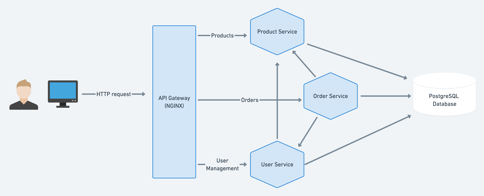
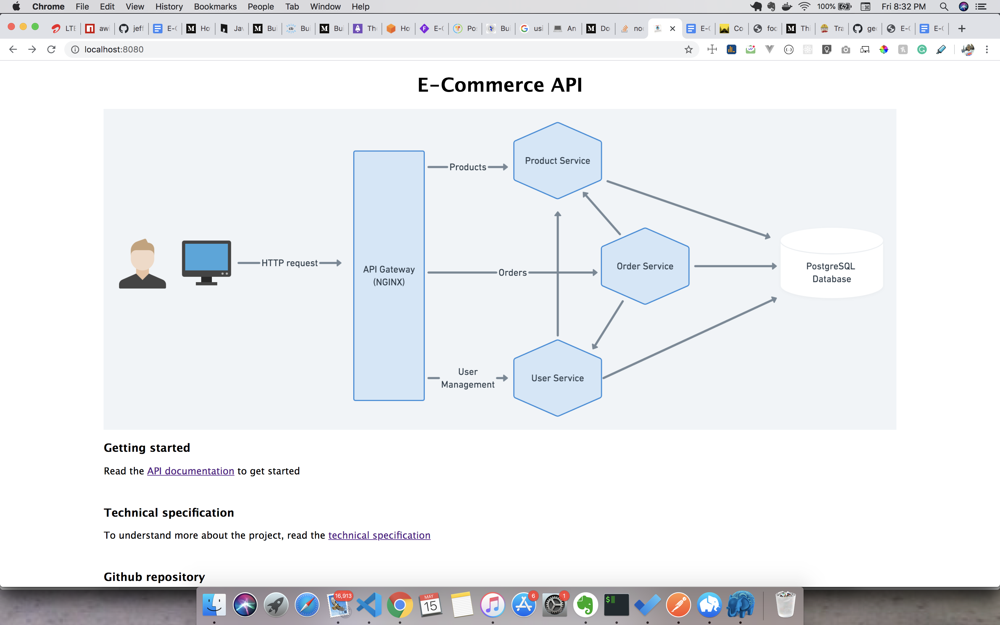

# E-Commerce-Microservice-API
An E-Commerce API built using the microservice layered architecture.

### Technologies 🛠
- Javascript 🦂- A high level programming language.
- Node.js :zap: - As an asynchronous event-driven JavaScript runtime, Node.js is designed to build scalable network applications.
- Express.js - Express is a minimal and flexible Node.js web application framework that provides a robust set of features for web and mobile applications. :fire:
- PostgreSQL :elephant: - PostgreSQL is a powerful, open source object-relational database system.
- Docker 🐳 - Docker is a tool designed to make it easier to create, deploy, and run applications by using containers.
- Docker Compose 🐙 - A tool for defining and running multi-container Docker applications
- Nginx 🚀- Nginx is a web server which can also be used as a reverse proxy, load balancer, mail proxy and HTTP cache

### Technical Spec
To get detailed information about the project. Read the [technical spec](https://docs.google.com/document/d/1t7YJjE6XvJiSVJBB21uKI7QaO5-j2KCg1DeLgAICtDA/edit?usp=sharing)

### Setup Instructions
- Make sure you have docker installed.
- Clone this repository.
- `cd` into the repository
- Run `docker-compose up` (Make sure you have a strong internet connection, LOL)
- Access the app on `http://localhost:8080` :zap: 

You should see

### API documentation
View the API docs [here](https://documenter.getpostman.com/view/5935573/Szmk1bGQ)

### Running tests
- `cd` into a s service directory e.g `cd products`
- Create a .env file
- Create a TEST_DB variable that points to your test database (Necessary for integration tests)
- Run `npm test` to run test.

### Author 
George Kurobara Benjamin
Built with 🍹 and 🎶
